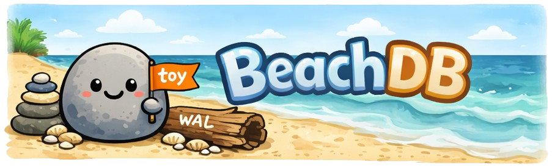

<!-- # BeachDB 🏖️ 🪨 -->

  

**BeachDB is a toy distributed NoSQL database. Built for learning and education, not production.**

It starts life as a small, inspectable storage engine, then deliberately grows “real-system bones”: a server API, a failure model, and a Raft-replicated core. The point isn’t to win benchmarks — it’s to understand, measure, and explain what’s actually happening.

### Backstory

I’ve been fond of distributed systems and databases for a long time. I wrote my first Hadoop and Apache Spark pipeline back in 2016, then went on to solve hairy stream-processing problems at Shopify, and later worked on Apache HBase at HubSpot where I helped build and operate database infrastructure on top of Kubernetes at massive scale.

BeachDB is my attempt to re-learn the fundamentals by building them from scratch in Go. I’m prioritizing **simplicity, clarity, and understanding** over scalability, speed, and micro-optimizations.

## Architecture

- **LSM storage engine** (WAL → memtable → SSTables → compaction)
- **Single-node API** (server wrapper for Get/Put/Delete/Scan with timeouts + backpressure)
- **Distributed replication with Raft** (single group: leader writes + leader reads; log entry == `WriteBatch`)
- **Inspectability-first** (dump tools + crash tests as part of the architecture)

## Key features (shipped as a checklist)

> This list is ordered to match the build + blog sequence. I’ll tick these off as they land.

### Engine (storage truth)
- [x] **Scope + semantics contract** (snapshots, iterators, durability), see: [intro blog post](https://aalhour.com/posts/building-beachdb/)
- [x] **WAL v1**: checksums + deterministic crash recovery (**fsync per committed batch**), see: [durability blog post](https://aalhour.com/posts/beachdb-wal-v1-milestone/)
- [ ] **Crash-loop harness**: kill mid-write, reopen, validate invariants
- [ ] **Memtable v1**: sorted structure + tombstones
- [ ] **Reference-model randomized tests** (model vs implementation)
- [ ] **SSTables v1**: immutable sorted files + `sst_dump`
- [ ] **Merge iterators** (memtable + SSTs) + **snapshot reads** (seqno-based)
- [ ] **Manifest/versioning** + `manifest_dump` (startup reconstruction)
- [ ] **Read path acceleration**: block index + bloom filters + benchmark evidence
- [ ] **Compaction v1**: one strategy, minimal knobs + amplification measurements
- [ ] **Adversarial testing**: fault injection + fuzzing (WAL/SST decode paths)

### Server (systems truth)
- [ ] **Binary protocol** (framed) + timeouts + backpressure
- [ ] **Load generator** + p50/p99 latency reporting
- [ ] **Metrics/tracing hooks** that make performance explainable

### Replication (distributed truth)
- [ ] **Raft (single group)** where a log entry == serialized `WriteBatch`
- [ ] **Deterministic apply** + restart safety
- [ ] **Snapshotting** for fast catch-up

### Sequel teaser (maybe)
- [ ] **Tables & Regions**: table-ish encoding + scans + key-range routing (minimal, no rabbit holes)

## Non-goals (by design)

To keep BeachDB small and finishable, these are intentionally out of scope for Season 1:

- Production readiness, multi-year maintenance guarantees, or compatibility promises
- Multi-writer concurrency in the engine (single-writer early on)
- Background compaction early on (added only after invariants are rock-solid)
- SQL, query planner, joins, secondary indexes
- Full transactions / serializable isolation
- Auto sharding, region split/merge, rebalancing, quorum reads, gossip/repair

<!-- ## Start here
- `docs/scope.md` — what BeachDB is (and is not)
- `docs/principles.md` — guiding principles + API style
- `docs/architecture.md` — components + invariants
- `bench/workloads.md` — fixed workloads for repeatable experiments
- `docs/articles.md` — Season 1 writing plan (≤ 12 posts)
-->

## Philosophy

> Every chapter ends with evidence: a dump tool, a crash test, a benchmark, or a diagram.

See [docs/principles.md](docs/principles.md) to see how I'm keeping this project from turning into a second job :)

## License

Apache 2.0 (see: [LICENSE](LICENSE))
